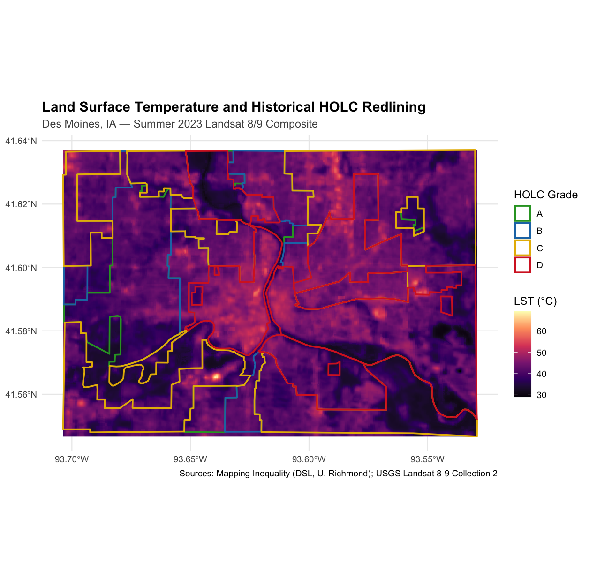

# Historical-Redlining-and-Land-Surface-Temperature-DSM
Spatial analysis examining whether 1930s HOLC redlining grades are associated with contemporary summer land surface temperature (LST), using Landsat 8/9 thermal imagery and digitized HOLC boundaries


## Motivation
Prior research links historical redlining to elevated present-day urban heat in several large U.S. metros. This project tests whether that pattern holds in the smaller, Midwestern city of Des Moines, Iowa as a self-directed methods exercise in spatial environmental epidemiology.

## Data Sources
 
| Data | Source | Access |
|---|---|---|
| HOLC redlining boundaries | Nelson, R.K., Winling, L. et al., *Mapping Inequality*, Digital Scholarship Lab, University of Richmond | [dsl.richmond.edu/panorama/redlining](https://dsl.richmond.edu/panorama/redlining/) via [BTAA Geoportal](https://geo.btaa.org/catalog/16fa01cf-7526-4f30-b8eb-77130d7d16e4) |
| Land surface temperature | USGS Landsat 8-9 OLI/TIRS Collection 2 Level-2 Science Products | Accessed via [Google Earth Engine](https://earthengine.google.com/) |

Full citations at the bottom of this README.

## Methods
 
1. Pulled Landsat 8/9 Collection 2 L2 Surface Temperature (ST_B10), summer 2023, cloud cover < 10%, via `rgee`
2. Converted to Celsius using standard USGS scale factors
3. Cleaned and reprojected HOLC polygon boundaries to match raster CRS
4. Extracted LST at polygon level (mean per polygon) and pixel level using `exactextractr`
5. Compared LST across HOLC grades (A–D) using Kruskal-Wallis tests at both polygon and pixel resolution

See full pipeline on [LST_Redlining.pdf](LST_Redlining.pdf)

## Requirements
 
```r
install.packages(c("rgee", "sf", "terra", "exactextractr", "dplyr", "ggplot2"))
```

Also requires:
- A free [Google Earth Engine](https://earthengine.google.com/) account
- `rgee::ee_install()` run once to configure the Python backend
## Usage
 
```r
# 1. Authenticate Earth Engine (one-time)
library(rgee)
ee_Initialize(drive = TRUE)
 
# 2. Run the full pipeline
source("LST_RedliningCode.R")
```

## Summary of Results
 
- Polygon-level test: no significant association (Kruskal-Wallis p = 0.86, n≈30)
- Pixel-level test: significant association (p < 2.2e-16, n≈thousands) — interpreted cautiously due to spatial autocorrelation
- Full discussion of effect sizes and limitations in [LST_Redlining.pdf](LST_Redlining.pdf)

## Repository Structure
 
```
.
├── LST_RedliningCode.R          # full code
├── LST_Redlining.pdf          # full write-up with methods, results, discussion
├── .png files            # exported plots (heatmap, boxplot, overlay map)
└── README.md
```
 
## Citations
 
Nelson, Robert K., LaDale Winling, et al., "Mapping Inequality," *American Panorama*, ed. Robert K. Nelson and Edward L. Ayers, accessed [date], https://dsl.richmond.edu/panorama/redlining/.
 
U.S. Geological Survey. Landsat 8-9 OLI/TIRS Collection 2 Level-2 Science Products [dataset]. https://doi.org/10.5066/P975CC9B
 
Gorelick, N., Hancher, M., Dixon, M., Ilyushchenko, S., Thau, D., & Moore, R. (2017). Google Earth Engine: Planetary-scale geospatial analysis for everyone. *Remote Sensing of Environment*, 202, 18-27.
